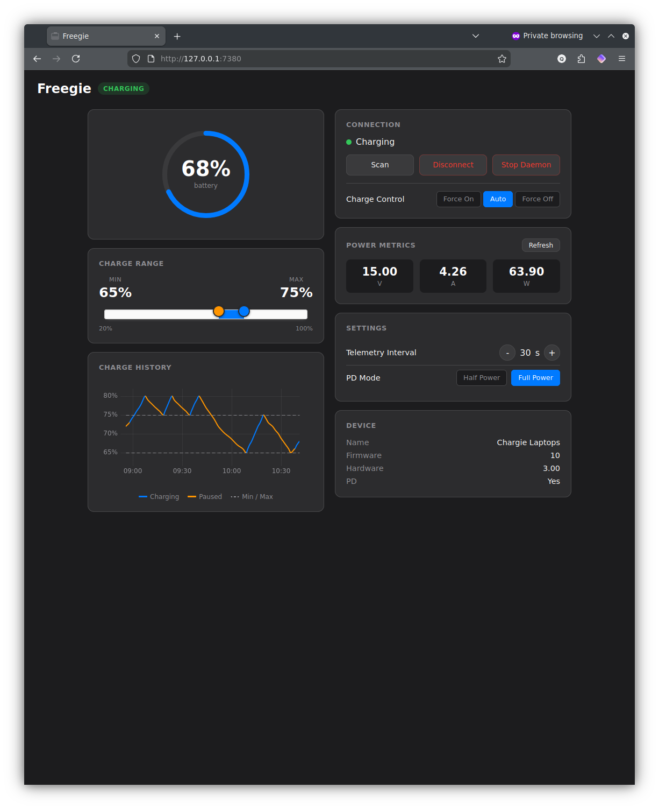
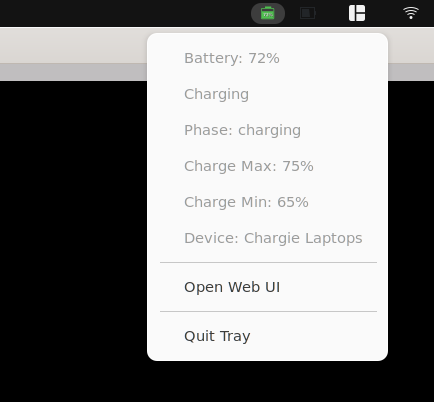

# Freegie

Open-source charge management daemon for [Chargie](https://chargie.org/) hardware on Linux.

> **Note:** This is a community-developed project and is not affiliated with, endorsed by, or supported by Chargie or Lighty Electronics. For official Chargie software, visit [chargie.org](https://chargie.org/).

Freegie connects to your Chargie device via Bluetooth Low Energy and automatically manages your laptop's charging to extend battery lifespan. It stops charging when your battery reaches a configurable maximum and resumes when it drops to a minimum threshold.

## Features

- Automatic charge limiting with configurable min/max thresholds
- USB Power Delivery (PD) renegotiation support
- Web UI for monitoring and control (http://127.0.0.1:7380)
- System tray icon with quick access to settings
- CLI for scripting and automation
- Runs as a systemd service

## Screenshots

**Web UI** — Monitor battery status and adjust charge limits



**System Tray** — Quick access from the desktop



## Requirements

- Linux (tested on Ubuntu 22.04+)
- Python 3.10+
- Bluetooth adapter with BLE support
- [Chargie](https://chargie.org/) hardware device

## Installation

### Quick install

```bash
git clone https://github.com/greghgradwell/freegie.git
cd freegie
./install.sh
```

This will:
- Create a Python virtual environment in `.venv`
- Install freegie
- Install and start the systemd service

Options:
- `./install.sh --with-tray` — Include system tray icon (requires system packages, see below)
- `./install.sh --port=8080` — Use a different port (default: 7380)
- `./install.sh --no-systemd` — Skip systemd service installation
- `PYTHON_BIN=python3 ./install.sh` — Use a different Python binary

### System tray icon (optional)

The tray icon requires system packages for GTK/AppIndicator support:

```bash
# Install system dependencies first
sudo apt install gir1.2-ayatanaappindicator3-0.1 python3-gi

# Then install with tray support
./install.sh --with-tray
```

### Manual installation

If you prefer step-by-step control:

```bash
# Create venv and install
make install-dev

# Activate the virtual environment
source .venv/bin/activate

# Test the daemon (foreground)
python -m freegie daemon --log-level debug

# Install systemd service
make install-systemd
sudo systemctl start freegie
```

## Usage

### Web UI

Once the daemon is running, open http://127.0.0.1:7380 in your browser to:
- View battery status and charge history
- Adjust charge min/max thresholds
- Monitor Chargie connection status
- See USB PD negotiation details

### CLI

```bash
# Show current status
python -m freegie status

# Set charge limits
python -m freegie set-max 80
python -m freegie set-min 40

# Scan for Chargie devices
python -m freegie scan

# Disconnect from device
python -m freegie disconnect

# Stop the daemon
python -m freegie stop
```

### System Tray

The tray icon shows current battery percentage and charging state. Right-click for quick access to:
- Current status
- Charge limit adjustment
- Web UI
- Quit

## Configuration

Freegie stores configuration in `~/.config/freegie/config.json`:

```json
{
  "charge": {
    "charge_max": 80,
    "charge_min": 40,
    "pd_mode": 1
  },
  "daemon": {
    "port": 7380,
    "log_level": "info"
  }
}
```

Runtime state (last known values) is stored in `~/.config/freegie/state.json`.

## Development

### Running tests

```bash
source .venv/bin/activate
pytest tests/ -v

# Hardware integration tests (requires connected Chargie)
pytest tests/test_integration.py -v --chargie
```

### Using justfile

If you have [just](https://github.com/casey/just) installed:

```bash
just test          # Run tests
just lint          # Run linter
just daemon-run    # Run daemon directly
just daemon-debug  # Run daemon with debug logging
just tray          # Run tray icon
```

### Project structure

```
freegie/
├── __main__.py    # Entry point and daemon runner
├── battery.py     # Linux battery status reader
├── ble.py         # Bluetooth LE communication
├── cli.py         # Command-line interface
├── config.py      # Configuration management
├── engine.py      # Charge management logic
├── protocol.py    # Chargie protocol parser
├── server.py      # HTTP API and web UI
└── tray.py        # System tray icon
```

## Uninstalling

```bash
./install.sh --uninstall
```

This stops and removes the systemd service, tray icon, desktop entry, and virtual environment.

## License

MIT License - see [LICENSE](LICENSE) for details.

## Acknowledgments

- [Chargie](https://chargie.org/) for the hardware that makes this possible
- [Bleak](https://github.com/hbldh/bleak) for cross-platform BLE support
