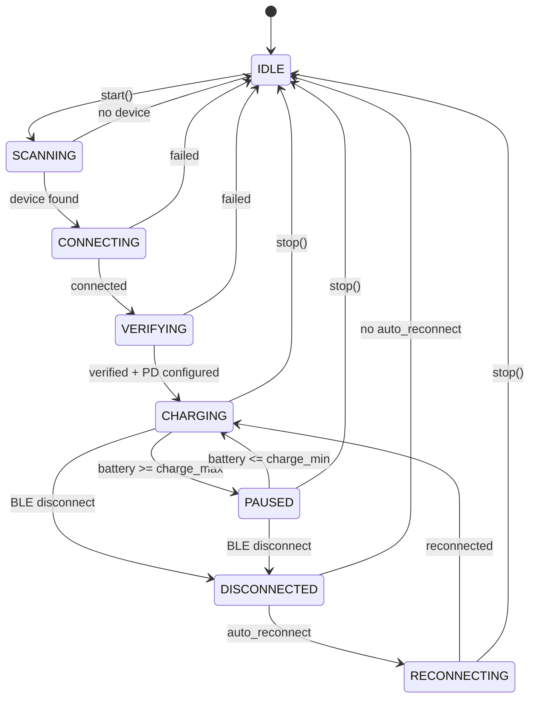

# Freegie State Machine

## Phase Transitions

## Power State Invariants

| Phase | `_charging` | Hardware Power |
|-------|-------------|----------------|
| CHARGING | `True` | ON |
| PAUSED | `False` | OFF |
| DISCONNECTED | `False` | unknown |
| IDLE | `False` | N/A |
| RECONNECTING | `False` | N/A |

`_charging` is reset to `False` on:
- `stop()`
- BLE disconnect (`_handle_ble_state(DISCONNECTED)`)

## Polling Model

Two independent loops run during CHARGING and PAUSED phases:

### sysfs loop (fast, control)
- **Interval:** `poll_interval` (default 3s)
- **Reads:** `battery.read_percent()` from `/sys/class/power_supply/BAT*/capacity`
- **Action:** Runs `_enforce_limit()` — only sends a BLE command when a threshold is crossed
- **Purpose:** Safety-critical charge control with minimal latency

### BLE telemetry loop (slow, display)
- **Interval:** `telemetry_interval` (default 30s)
- **Sends:** `AT+STAT` over BLE
- **Reads:** Voltage and amperage from the Chargie device
- **Purpose:** UI display of power metrics

The sysfs loop handles 99% of cycles with zero BLE traffic. BLE commands are only sent when:
1. Battery crosses `charge_max` → `_power_off()`
2. Battery crosses `charge_min` → `_power_on()`
3. Safety net: CHARGING but `_charging=False` → `_power_on()`

## Power Commands

All power state changes go through two centralized helpers:

### `_power_on()`
1. Send `CMD_POWER_ON` (`AT+PIO21`)
2. Parse response — raise `ConnectionError` if device reports OFF
3. Set `_charging = True`
4. Caller fires `_confirm_sysfs_charging(True)` as a background task

### `_power_off()`
1. Send `CMD_POWER_OFF` (`AT+PIO20`)
2. Parse response — raise `ConnectionError` if device reports ON
3. Set `_charging = False`
4. Caller fires `_confirm_sysfs_charging(False)` as a background task

### sysfs Confirmation
After a power toggle, `_confirm_sysfs_charging()` polls `battery.read_status()` for up to 10s to verify the OS sees the expected `"Charging"` or `"Not charging"` status. Logs a warning on timeout but does not block or raise.

## Override Mode

The engine supports a manual override flag (`_override`) that is orthogonal to the phase state machine. It has three values:

| `_override` | Meaning |
|-------------|---------|
| `None` | Auto — `_enforce_limit()` controls power normally |
| `"on"` | Force charge ON — `_enforce_limit()` is a no-op |
| `"off"` | Force charge OFF — `_enforce_limit()` is a no-op |

### Behavior

- When override is `"on"` or `"off"`, `_enforce_limit()` returns immediately. The sysfs polling loop continues running for battery % updates.
- Phase still reflects the actual hardware power state: `CHARGING` when power is on (force-on or auto), `PAUSED` when power is off (force-off or auto).
- Override can only be set when connected (phase is `CHARGING` or `PAUSED`). Setting to `"auto"` is always allowed.

### Clearing

Override is reset to `None` on:
1. User selects "Auto" (`set_override("auto")`)
2. BLE disconnect (`_handle_ble_state(DISCONNECTED)`)
3. `stop()` called

When override is cleared via "Auto", `_enforce_limit()` runs immediately so the engine re-evaluates thresholds without waiting for the next poll cycle.
